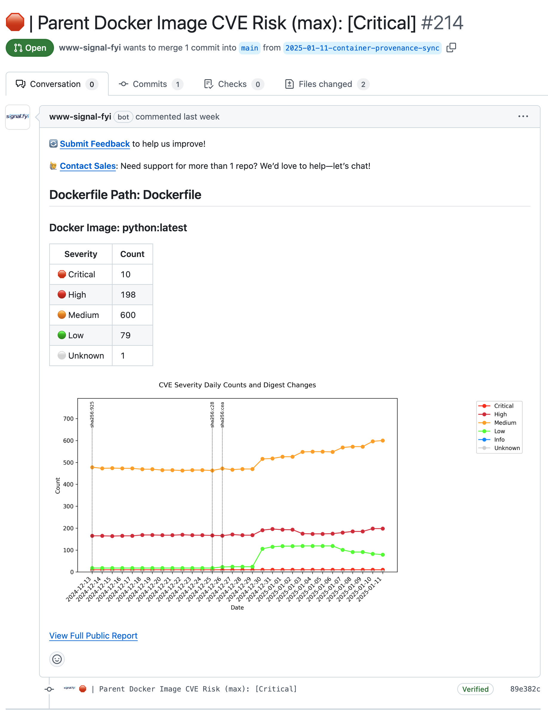
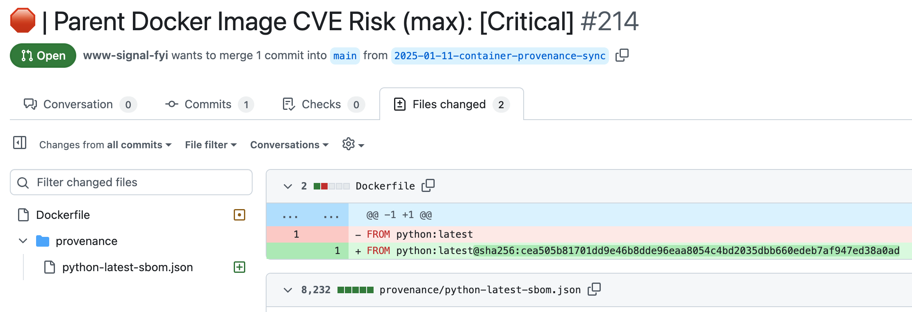

# **Automated Public Docker Image Compliance & Reporting**

**Automate Public Docker Image digest (version) management with actionable insights directly in your pull requests.**
signal.fyi scans Public Docker Images daily, generating pull requests with enriched context for security, compliance, and efficiency.

### **Key Benefits**
- **Save Time**: Automates Public Docker Image updates and CVE summaries, reducing manual effort.
- **Stay Secure**: Highlights vulnerabilities directly in pull request reviews, with a visual summary of CVE trends.
- **Be Compliant**: Provides standardized SBOMs and metadata for regulatory and organizational needs.
- **Visual Insights**: Includes a graph tracking vulnerability severity and image digest changes, enabling quick trend analysis.

👉 Curious? [See a Pull Request Example](#pull-request-example)
💼 Ready to try? [Install signal.fyi from GitHub Marketplace](https://github.com/marketplace/www-signal-fyi)

---

## **Repository Overview**

This repository provides:

1. **Daily Reports**: signal.fyi generates and hosts comprehensive reports for Public Docker Images, including:
   - **SBOMs (Software Bill of Materials)**: A transparent inventory of software components for compliance and dependency tracking.
     - **Shareable Reports**: Easily share with stakeholders, vendors, or auditors without needing access to private repositories.
     - **Regulatory Ready**: Delivered in a standardized format to simplify compliance and audits.
   - **CVE Summaries**: Enriched insights into security vulnerabilities, categorized by severity (Critical, High, Medium, etc.).
   - **Docker Image Metadata**: Detailed information such as image digest (`sha256`), creation date, and size for version control and traceability.
   - **Provenance Artifacts**: Clear records of updates and risks to support debugging, compliance, and long-term tracking.

2. **Community Support**: A space to ask questions, report issues, and share feedback.

---

### **Report File Descriptions**

Each report contains the following files:

1. **`1-data.json`**
   - **Description**: Metadata and a summary of the Docker image report.
   - **Contents**:
     - Branch name and file paths for associated artifacts (SBOM, PNG).
     - Docker image details (name, tag, digest).
     - Severity summary of vulnerabilities (Critical, High, Medium, Low, Info, Unknown).
   - **Purpose**:
     - Acts as a centralized index for the report.
     - Links to associated files for easy access.

2. **`1-sbom.json`**
   - **Description**: A Software Bill of Materials (SBOM) in CycloneDX v1.6 format.
   - **Contents**:
     - An inventory of components and dependencies in the Docker image.
     - Dependency relationships, versions, and metadata.
   - **Purpose**:
     - Helps teams track dependencies and ensure compliance with organizational and security policies.

3. **`1-cve-digest-history.png`**
   - **Description**: A visual representation of CVE severity summary counts and digest changes over time.
   - **Contents**:
     - A line graph plotting the counts of vulnerabilities (Critical, High, Medium, etc.) against image digests.
   - **Purpose**:
     - Provides an at-a-glance view of vulnerability trends and digest updates for the Public Docker Image.

---

### **Example Report**

Here’s an example of a public report for the `python` Docker image with the `latest` tag from **2025-01-11**:
- **`1-data.json`**: [View File](https://github.com/signalfyi/support/blob/main/public/reports/2025/01/11/python/latest/1-data.json)
- **`1-sbom.json`**: [View File](https://github.com/signalfyi/support/blob/main/public/reports/2025/01/11/python/latest/1-sbom.json)
- **`1-cve-digest-history.png`**: [View File](https://github.com/signalfyi/support/blob/main/public/reports/2025/01/11/python/latest/1-cve-digest-history.png)

---

### **Pull Request Example**

Here’s what signal.fyi adds to your pull requests:

**Pull Request Body**
_Automated insights summarizing vulnerabilities and updates:_

**Files Changed View**
_Dockerfile updates, provenance artifacts, and metadata:_

---

### **Feedback and Support**

Have questions or suggestions? [Open an issue in the repository](https://github.com/signalfyi/support/issues).

---

## **Important Note on Report Organization**
- **Future Changes**: While reports for Public Docker Images will remain accessible, the structure or location of reports may evolve as signal.fyi adapts to user needs.
- **Transparency Commitment**: Any changes to report organization will be communicated through this repository to ensure users stay informed.
